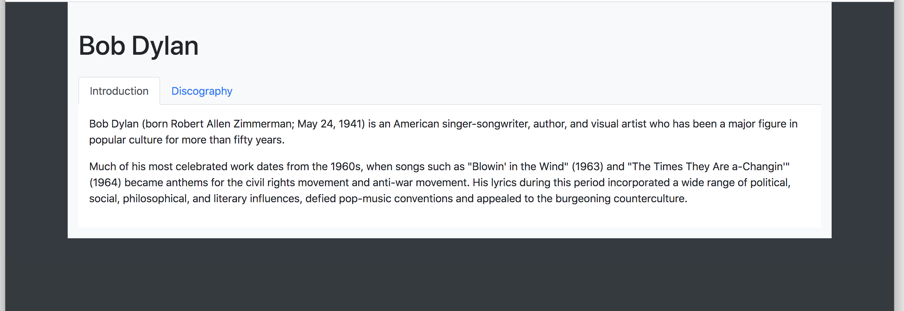

# Bootstrap

Bootstrap is a free and open-source CSS framework directed at responsive, mobile-first front-end web development. 
It contains <strong>CSS</strong> and <strong>JavaScript</strong> design templates for <em>typography, forms, buttons, navigation, and other interface components.</em>

For this project, you will use Bootstrap 4.4 and only the CSS styling part.

<h2>Resources</h2>

<strong>Read or watch</strong>:

<ul>
<li><a href="https://getbootstrap.com/docs/4.4/getting-started/introduction/" title="Bootstrap" target="_blank">Bootstrap</a> </li>
</ul>

<h2>Learning Objectives</h2>

At the end of this project, you are expected to be able to <a href="https://fs.blog/feynman-learning-technique/" title="explain to anyone" target="_blank">explain to anyone</a>, <strong>without the help of Google</strong>:

<h3>General</h3>

<ul>
<li>Usage of Containers</li>
<li>Usage of the Grid system</li>
<li>Usage of Components</li>
<li>Usage of Utilities</li>
</ul>

<h2>Requirements</h2>

<h3>General</h3>

<ul>
<li>A <code>README.md</code> file, at the root of the folder of the project, is mandatory</li>
<li>Use Bootstrap version 4.4.1</li>
</ul>

<h2>Use the CDN version</h2>

Add this <code>&lt;link&gt;</code> in the <code>&lt;head&gt;</code> part of your HTML

<pre><code>&lt;link rel=&quot;stylesheet&quot; href=&quot;https://stackpath.bootstrapcdn.com/bootstrap/4.4.1/css/bootstrap.min.css&quot; integrity=&quot;sha384-Vkoo8x4CGsO3+Hhxv8T/Q5PaXtkKtu6ug5TOeNV6gBiFeWPGFN9MuhOf23Q9Ifjh&quot; crossorigin=&quot;anonymous&quot;&gt;
</code></pre>

  

<h2 class="gap">Tasks</h2>
    

      

  

  

    <h3 class="panel-title">
      0. Reboot styling
    </h3>
  

  

    

   <!-- Task Body -->
   
From this HTML:

<pre><code>&lt;!DOCTYPE html&gt;
&lt;html lang=&quot;en&quot; dir=&quot;ltr&quot;&gt;
    &lt;head&gt;
        &lt;meta charset=&quot;utf-8&quot;&gt;
        &lt;meta name=&quot;viewport&quot; content=&quot;width=device-width, initial-scale=1, viewport-fit=cover&quot;&gt;
        &lt;title&gt;Holberton - Web Stack - Bootstrap&lt;/title&gt;
        &lt;meta name=&quot;description&quot; content=&quot;Bootstrap is a free and open-source CSS framework&quot;&gt;

        &lt;style&gt;
            .my-container {
                background-color: #FF0000;
            }
        &lt;/style&gt;
    &lt;/head&gt;
    &lt;body&gt;

        &lt;div class=&quot;my-container&quot;&gt;
            &lt;h1&gt;Hello&lt;/h1&gt;
            &lt;h2&gt;Holberton&lt;/h2&gt;
            &lt;p&gt;Lorem ipsum dolor sit amet, consectetur adipiscing elit. Aliquam placerat eleifend nulla, quis imperdiet lacus. Donec tempor lorem enim, sit amet tempus purus euismod sit amet. Nam laoreet quis purus a consequat. Quisque interdum bibendum varius. Praesent lobortis eros sit amet tortor varius elementum. Fusce eget varius ex. Cras id lectus consectetur, bibendum dolor in, hendrerit lacus. Praesent rutrum, odio id tincidunt fringilla, dolor eros condimentum lacus, blandit molestie massa velit hendrerit risus. Nam ex nunc, ultrices id nisi consectetur, mattis imperdiet purus. Sed tempus ullamcorper nisi, vitae pulvinar nunc varius eu. Maecenas ut volutpat lectus.&lt;/p&gt;
            &lt;ul&gt;
                &lt;li&gt;Lorem ipsum dolor sit amet, consectetur adipiscing elit.&lt;/li&gt;
                &lt;li&gt;Phasellus quis dolor sed ligula porttitor fringilla.&lt;/li&gt;
                &lt;li&gt;
                    &lt;ul&gt;
                        &lt;li&gt;Integer vulputate arcu quis luctus condimentum.&lt;/li&gt;
                        &lt;li&gt;Integer commodo turpis non ligula viverra, ut sagittis elit ornare.&lt;/li&gt;
                    &lt;/ul&gt;
                &lt;/li&gt;
                &lt;li&gt;Etiam porttitor justo in diam elementum, nec mollis tellus viverra.&lt;/li&gt;
                &lt;li&gt;Vivamus non ligula quis dui auctor sagittis.&lt;/li&gt;
            &lt;/ul&gt;
        &lt;/div&gt;

    &lt;/body&gt;
&lt;/html&gt;
</code></pre>

Add Bootstrap to reset the CSS styling.

Your final page must look like this:

  

    <h3 class="panel-title">
      1. Blocks
    </h3>
  

  <!-- Task Body -->
  
From this HTML:

<pre><code>&lt;!DOCTYPE html&gt;
&lt;html lang=&quot;en&quot; dir=&quot;ltr&quot;&gt;
    &lt;head&gt;
        &lt;meta charset=&quot;utf-8&quot;&gt;
        &lt;meta name=&quot;viewport&quot; content=&quot;width=device-width, initial-scale=1, viewport-fit=cover&quot;&gt;
        &lt;title&gt;Holberton - Web Stack - Bootstrap&lt;/title&gt;
        &lt;meta name=&quot;description&quot; content=&quot;Bootstrap is a free and open-source CSS framework&quot;&gt;

        &lt;link rel=&quot;stylesheet&quot; href=&quot;https://stackpath.bootstrapcdn.com/bootstrap/4.4.1/css/bootstrap.min.css&quot; integrity=&quot;sha384-Vkoo8x4CGsO3+Hhxv8T/Q5PaXtkKtu6ug5TOeNV6gBiFeWPGFN9MuhOf23Q9Ifjh&quot; crossorigin=&quot;anonymous&quot;&gt;
    &lt;/head&gt;
    &lt;body&gt;
        &lt;div&gt;
            &lt;div&gt;Primary&lt;/div&gt;
            &lt;div&gt;Success&lt;/div&gt;
            &lt;div&gt;Danger&lt;/div&gt;
            &lt;div&gt;Warning&lt;/div&gt;
        &lt;/div&gt;

        &lt;hr /&gt;

        &lt;div&gt;
            &lt;div&gt;Primary&lt;/div&gt;
            &lt;div&gt;Success&lt;/div&gt;
            &lt;div&gt;Danger&lt;/div&gt;
            &lt;div&gt;Warning&lt;/div&gt;
        &lt;/div&gt;

        &lt;hr /&gt;

        &lt;div&gt;
            &lt;div&gt;Primary&lt;/div&gt;
            &lt;div&gt;Success&lt;/div&gt;
            &lt;div&gt;Danger&lt;/div&gt;
        &lt;/div&gt;

        &lt;hr /&gt;

        &lt;div&gt;
            &lt;div&gt;Primary&lt;/div&gt;
            &lt;div&gt;Success&lt;/div&gt;
            &lt;div&gt;Danger&lt;/div&gt;
            &lt;div&gt;Warning&lt;/div&gt;
        &lt;/div&gt;

        &lt;hr/&gt;

        &lt;div&gt;
            &lt;div&gt;Primary&lt;/div&gt;
            &lt;div&gt;Success&lt;/div&gt;
        &lt;/div&gt;

        &lt;hr/&gt;

        &lt;div&gt;
            &lt;div&gt;Primary&lt;/div&gt;
            &lt;div&gt;Success&lt;/div&gt;
            &lt;div&gt;Danger&lt;/div&gt;
        &lt;/div&gt;
    &lt;/body&gt;
&lt;/html&gt;
</code></pre>

Build this responsive web page:

<strong>Requirements:</strong>

<ul>
<li>You are not allow to define any styling in a CSS file, in head or inline - only Bootstrap classes</li>
<li>You can not change the HTML structure - only adding classes is allowed</li>
</ul>

<strong>Behaviors/styles:</strong>

For all cells of all rows:

<ul>
<li>Padding at <code>.5rem</code></li>
<li>Background color of the name of the cell</li>
<li>Text centered and white</li>
</ul>

<strong>First line:</strong>

<ul>
<li>Each cell has the same width</li>
<li>Screen &gt;= 992px: display like 4 columns in one line</li>
<li>Screen &lt; 992px: display like 4 lines in one column</li>
</ul>

<strong>Second line:</strong>

<ul>
<li>Each cell has the same width</li>
<li>Screen &gt;= 576px: display like 4 columns in one line</li>
<li>Screen &lt; 576px: display like 4 lines in one column</li>
</ul>

<strong>Third line:</strong>

<ul>
<li>The last cell is taking 50% of the width screen</li>
<li>The middle cell has 2 times the size of the first cell</li>
<li>Screen &gt;= 992px: display like 3 columns in one line</li>
<li>Screen &lt; 992px: display like 3 lines in one column</li>
</ul>

<strong>Fourth line:</strong>

<ul>
<li>Different order (from left to right) based on the size</li>
<li>Screen &gt;= 1200px: Primary -&gt; Success -&gt; Danger -&gt; Warning</li>
<li>Screen between 992px and 1200px: Warning -&gt; Primary -&gt; Success -&gt; Danger</li>
<li>Screen between 768px and 992px: Danger -&gt; Warning -&gt; Primary -&gt; Success</li>
<li>Screen &lt;= 768px: Success -&gt; Danger -&gt; Warning -&gt; Primary</li>
</ul>

<strong>Fifth line:</strong>

<ul>
<li>Each cell has the same width (~16% of the screen)</li>
<li>Screen &gt;= 768px: display like 2 columns on each side of the screen in one line</li>
<li>Screen &lt; 768px: display like 2 lines in one column</li>
</ul>

<strong>Last line:</strong>

<ul>
<li>Each cell has the same width (~16% of the screen)</li>
<li>Screen &gt;= 768px: display like 3 columns in one line with the space between the first and middle cell 2 times bigger than the space between the middle cell and the last cell</li>
<li>Screen &lt; 768px: display like 3 lines in one column</li>
</ul>

  

    <h3 class="panel-title">
      2. Table of chemical elements
    </h3>
  

  

    

  <!-- Task Body -->
  
From this HTML:

<pre><code>&lt;!DOCTYPE html&gt;
&lt;html lang=&quot;en&quot; dir=&quot;ltr&quot;&gt;
    &lt;head&gt;
        &lt;meta charset=&quot;utf-8&quot;&gt;
        &lt;meta name=&quot;viewport&quot; content=&quot;width=device-width, initial-scale=1, viewport-fit=cover&quot;&gt;
        &lt;title&gt;Holberton - Web Stack - Bootstrap&lt;/title&gt;
        &lt;meta name=&quot;description&quot; content=&quot;Bootstrap is a free and open-source CSS framework&quot;&gt;

        &lt;link rel=&quot;stylesheet&quot; href=&quot;https://stackpath.bootstrapcdn.com/bootstrap/4.4.1/css/bootstrap.min.css&quot; integrity=&quot;sha384-Vkoo8x4CGsO3+Hhxv8T/Q5PaXtkKtu6ug5TOeNV6gBiFeWPGFN9MuhOf23Q9Ifjh&quot; crossorigin=&quot;anonymous&quot;&gt;
    &lt;/head&gt;
    &lt;body&gt;
        &lt;header&gt;
            &lt;ul&gt;
                &lt;li&gt;
                    &lt;a href=&quot;/&quot;&gt;
                        &lt;img src=&quot;https://via.placeholder.com/150x50&quot; /&gt;
                    &lt;/a&gt;
                &lt;/li&gt;
                &lt;li&gt;
                    &lt;a href=&quot;#&quot;&gt;Chemical elements&lt;/a&gt;
                &lt;/li&gt;
                &lt;li&gt;
                    &lt;a href=&quot;#&quot;&gt;Profile&lt;/a&gt;
                &lt;/li&gt;
            &lt;/ul&gt;
        &lt;/header&gt;

        &lt;main&gt;
            &lt;section&gt;
                &lt;div role=&quot;alert&quot;&gt;
                    &lt;h4&gt;List of chemical elements&lt;/h4&gt;
                    &lt;p&gt;This is a list of the 5 first chemical elements which have been identified as of 2019.&lt;/p&gt;
                    &lt;hr&gt;
                    &lt;p&gt;A popular visualization of all 118 elements is &lt;a href=&quot;https://en.wikipedia.org/wiki/Periodic_table&quot;&gt;the periodic table of the elements&lt;/a&gt;.&lt;/p&gt;
                &lt;/div&gt;
            &lt;/section&gt;

            &lt;section&gt;
                &lt;h1&gt;Chemical elements &lt;span&gt;only 5&lt;/span&gt;&lt;/h1&gt;

                &lt;div&gt;
                    &lt;table&gt;
                        &lt;thead&gt;
                            &lt;tr&gt;
                                &lt;th scope=&quot;col&quot;&gt;Atomic number&lt;/th&gt;
                                &lt;th scope=&quot;col&quot;&gt;Symbol&lt;/th&gt;
                                &lt;th scope=&quot;col&quot;&gt;Element&lt;/th&gt;
                                &lt;th scope=&quot;col&quot;&gt;Origin of name&lt;/th&gt;
                                &lt;th scope=&quot;col&quot;&gt;Group&lt;/th&gt;
                                &lt;th scope=&quot;col&quot;&gt;Period&lt;/th&gt;
                                &lt;th scope=&quot;col&quot;&gt;Atomic weight&lt;/th&gt;
                                &lt;th scope=&quot;col&quot;&gt;Density&lt;/th&gt;
                                &lt;th scope=&quot;col&quot;&gt;Melting point&lt;/th&gt;
                                &lt;th scope=&quot;col&quot;&gt;Boiling point&lt;/th&gt;
                                &lt;th scope=&quot;col&quot;&gt;Specific heat capacity&lt;/th&gt;
                                &lt;th scope=&quot;col&quot;&gt;Electro­negativity&lt;/th&gt;
                                &lt;th scope=&quot;col&quot;&gt;Abundance in Earth&#39;s crust&lt;/th&gt;
                            &lt;/tr&gt;
                        &lt;/thead&gt;
                        &lt;tbody&gt;
                            &lt;tr&gt;
                                &lt;td&gt;1&lt;/td&gt;
                                &lt;td&gt;H&lt;/td&gt;
                                &lt;td&gt;Hydrogen&lt;/td&gt;
                                &lt;td&gt;Greek elements &lt;i&gt;hydro-&lt;/i&gt; and &lt;i&gt;-gen&lt;/i&gt;, meaning &#39;water-forming&#39;&lt;/td&gt;
                                &lt;td&gt;1&lt;/td&gt;
                                &lt;td&gt;1&lt;/td&gt;
                                &lt;td&gt;1.008&lt;/td&gt;
                                &lt;td&gt;0.00008988&lt;/td&gt;
                                &lt;td&gt;14.01&lt;/td&gt;
                                &lt;td&gt;20.28&lt;/td&gt;
                                &lt;td&gt;14.304&lt;/td&gt;
                                &lt;td&gt;2.20&lt;/td&gt;
                                &lt;td&gt;1400&lt;/td&gt;
                            &lt;/tr&gt;
                            &lt;tr&gt;
                                &lt;td&gt;2&lt;/td&gt;
                                &lt;td&gt;He&lt;/td&gt;
                                &lt;td&gt;Helium&lt;/td&gt;
                                &lt;td&gt;Greek &lt;i&gt;hḗlios&lt;/i&gt;, &#39;sun&#39;&lt;/td&gt;
                                &lt;td&gt;18&lt;/td&gt;
                                &lt;td&gt;1&lt;/td&gt;
                                &lt;td&gt;4.002602&lt;/td&gt;
                                &lt;td&gt;0.0001785&lt;/td&gt;
                                &lt;td&gt;—&lt;/td&gt;
                                &lt;td&gt;4.22&lt;/td&gt;
                                &lt;td&gt;5.193&lt;/td&gt;
                                &lt;td&gt;–&lt;/td&gt;
                                &lt;td&gt;0.008&lt;/td&gt;
                            &lt;/tr&gt;
                            &lt;tr&gt;
                                &lt;td&gt;3&lt;/td&gt;
                                &lt;td&gt;Li&lt;/td&gt;
                                &lt;td&gt;Lithium&lt;/td&gt;
                                &lt;td&gt;Greek &lt;i&gt;líthos&lt;/i&gt;, &#39;stone&#39;&lt;/td&gt;
                                &lt;td&gt;1&lt;/td&gt;
                                &lt;td&gt;2&lt;/td&gt;
                                &lt;td&gt;6.94&lt;/td&gt;
                                &lt;td&gt;0.534&lt;/td&gt;
                                &lt;td&gt;453.69&lt;/td&gt;
                                &lt;td&gt;1560&lt;/td&gt;
                                &lt;td&gt;3.582&lt;/td&gt;
                                &lt;td&gt;0.98&lt;/td&gt;
                                &lt;td&gt;20&lt;/td&gt;
                            &lt;/tr&gt;
                            &lt;tr&gt;
                                &lt;td&gt;4&lt;/td&gt;
                                &lt;td&gt;Be&lt;/td&gt;
                                &lt;td&gt;Beryllium&lt;/td&gt;
                                &lt;td&gt;Beryl, a mineral (ultimately from the name of Belur in southern India)&lt;/td&gt;
                                &lt;td&gt;2&lt;/td&gt;
                                &lt;td&gt;2&lt;/td&gt;
                                &lt;td&gt;9.0121831&lt;/td&gt;
                                &lt;td&gt;1.85&lt;/td&gt;
                                &lt;td&gt;1560&lt;/td&gt;
                                &lt;td&gt;2742&lt;/td&gt;
                                &lt;td&gt;1.825&lt;/td&gt;
                                &lt;td&gt;1.57&lt;/td&gt;
                                &lt;td&gt;2.8&lt;/td&gt;
                            &lt;/tr&gt;
                            &lt;tr&gt;
                                &lt;td&gt;5&lt;/td&gt;
                                &lt;td&gt;B&lt;/td&gt;
                                &lt;td&gt;Boron&lt;/td&gt;
                                &lt;td&gt;Borax, a mineral (from Arabic &lt;i&gt;bawraq&lt;/i&gt;)&lt;/td&gt;
                                &lt;td&gt;13&lt;/td&gt;
                                &lt;td&gt;2&lt;/td&gt;
                                &lt;td&gt;10.81&lt;/td&gt;
                                &lt;td&gt;2.34&lt;/td&gt;
                                &lt;td&gt;2349&lt;/span&gt;&lt;/td&gt;
                                &lt;td&gt;4200&lt;/td&gt;
                                &lt;td&gt;1.026&lt;/td&gt;
                                &lt;td&gt;2.04&lt;/td&gt;
                                &lt;td&gt;10&lt;/td&gt;
                            &lt;/tr&gt;
                        &lt;/tbody&gt;
                    &lt;/table&gt;
                &lt;/div&gt;
            &lt;/section&gt;
        &lt;/main&gt;
    &lt;/body&gt;
&lt;/html&gt;
</code></pre>

Build this responsive web page:

<strong>Requirements:</strong>

<ul>
<li>You are not allow to define any styling in a CSS file, in head or inline - only Bootstrap classes</li>
<li>You can not change the HTML structure - only adding classes is allowed</li>
</ul>

<strong>Behaviors/styles:</strong>

<ul>
<li>Header:

<ul>
<li>With border bottom</li>
<li>Padding <code>.5rem</code> and margin bottom <code>1rem</code></li>
<li>Background color &ldquo;light&rdquo;</li>
<li>Horizontal listing, no margin bottom:

<ul>
<li>First item aligned on the left with a border rounded image</li>
<li>2 other items aligned on the right with 2 links (aligned vertically in the middle) with a layout of a button of style &ldquo;secondary&rdquo; </li>
<li>The link &ldquo;Chemical elements&rdquo; is active</li>
</ul></li>
</ul></li>
<li>The <code>main</code> block has full width, spanning the entire width of the viewport</li>
<li>The first <code>section</code>:

<ul>
<li>The div inside is an alert of style &ldquo;info&rdquo;:

<ul>
<li><code>h4</code> is the header of this alert</li>
<li>The last paragraph (containing the link) should not have any margin bottom</li>
</ul></li>
</ul></li>
<li>The second <code>section</code>:

<ul>
<li><code>h1</code> has a margin bottom at <code>1.5rem</code> and margin top at <code>3rem</code></li>
<li>Inside the <code>h1</code>, &ldquo;only 5&rdquo; has a badge layout of type &ldquo;info&rdquo;</li>
<li>The <code>div</code> is able to make the <code>table</code> responsive with a break at <code>992px</code></li>
<li>The <code>table</code> has &ldquo;dark&rdquo; style and hover on rows</li>
</ul></li>
</ul>

  

    <h3 class="panel-title">
      3. Cards
    </h3>

  

   <!-- Task Body -->
  
From this HTML:

<pre><code>&lt;!DOCTYPE html&gt;
&lt;html lang=&quot;en&quot; dir=&quot;ltr&quot;&gt;
    &lt;head&gt;
        &lt;meta charset=&quot;utf-8&quot;&gt;
        &lt;meta name=&quot;viewport&quot; content=&quot;width=device-width, initial-scale=1, viewport-fit=cover&quot;&gt;
        &lt;title&gt;Holberton - Web Stack - Bootstrap&lt;/title&gt;
        &lt;meta name=&quot;description&quot; content=&quot;Bootstrap is a free and open-source CSS framework&quot;&gt;

        &lt;link rel=&quot;stylesheet&quot; href=&quot;https://stackpath.bootstrapcdn.com/bootstrap/4.4.1/css/bootstrap.min.css&quot; integrity=&quot;sha384-Vkoo8x4CGsO3+Hhxv8T/Q5PaXtkKtu6ug5TOeNV6gBiFeWPGFN9MuhOf23Q9Ifjh&quot; crossorigin=&quot;anonymous&quot;&gt;

        &lt;script src=&quot;https://code.jquery.com/jquery-3.4.1.min.js&quot; integrity=&quot;sha256-CSXorXvZcTkaix6Yvo6HppcZGetbYMGWSFlBw8HfCJo=&quot; crossorigin=&quot;anonymous&quot;&gt;&lt;/script&gt;
        &lt;script src=&quot;https://stackpath.bootstrapcdn.com/bootstrap/4.4.1/js/bootstrap.min.js&quot; integrity=&quot;sha384-wfSDF2E50Y2D1uUdj0O3uMBJnjuUD4Ih7YwaYd1iqfktj0Uod8GCExl3Og8ifwB6&quot; crossorigin=&quot;anonymous&quot;&gt;&lt;/script&gt;
    &lt;/head&gt;
    &lt;body&gt;
        &lt;div&gt;
            &lt;div&gt;
                &lt;div&gt;
                    &lt;div&gt;
                        &lt;div&gt;Coding&lt;/div&gt;
                        &lt;img src=&quot;https://via.placeholder.com/450x200&quot; /&gt;
                        &lt;div&gt;
                            &lt;h5&gt;HTML&lt;/h5&gt;
                            &lt;p&gt;Hypertext Markup Language (HTML) is the standard markup language for documents designed to be displayed in a web browser.&lt;/p&gt;
                            &lt;button data-toggle=&quot;modal&quot; data-target=&quot;#playModal&quot;&gt;Play with&lt;/button&gt;
                        &lt;/div&gt;
                        &lt;div&gt;40h&lt;/div&gt;
                    &lt;/div&gt;
                &lt;/div&gt;
                &lt;div&gt;
                    &lt;div&gt;
                        &lt;div&gt;Coding&lt;/div&gt;
                        &lt;img src=&quot;https://via.placeholder.com/450x200&quot; /&gt;
                        &lt;div&gt;
                            &lt;h5&gt;CSS&lt;/h5&gt;
                            &lt;p&gt;Cascading Style Sheets (CSS) is a style sheet language used for describing the presentation of a document written in a markup language like HTML.&lt;/p&gt;
                            &lt;button data-toggle=&quot;modal&quot; data-target=&quot;#playModal&quot;&gt;Play with&lt;/button&gt;
                        &lt;/div&gt;
                        &lt;div&gt;35h&lt;/div&gt;
                    &lt;/div&gt;
                &lt;/div&gt;
                &lt;div&gt;
                    &lt;div&gt;
                        &lt;div&gt;Coding&lt;/div&gt;
                        &lt;img src=&quot;https://via.placeholder.com/450x200&quot; /&gt;
                        &lt;div&gt;
                            &lt;h5&gt;Javascript&lt;/h5&gt;
                            &lt;p&gt;JavaScript, often abbreviated as JS, is a programming language that conforms to the ECMAScript specification.&lt;/p&gt;
                            &lt;button data-toggle=&quot;modal&quot; data-target=&quot;#playModal&quot;&gt;Play with&lt;/button&gt;
                        &lt;/div&gt;
                        &lt;div&gt;70h&lt;/div&gt;
                    &lt;/div&gt;
                &lt;/div&gt;
            &lt;/div&gt;
        &lt;/div&gt;

        &lt;!-- Modal --&gt;
        &lt;div id=&quot;playModal&quot; tabindex=&quot;-1&quot; role=&quot;dialog&quot; aria-labelledby=&quot;playModal&quot; aria-hidden=&quot;true&quot;&gt;
            &lt;div role=&quot;document&quot;&gt;
                &lt;div&gt;
                    &lt;div&gt;
                        &lt;h5 id=&quot;exampleModalLabel&quot;&gt;Play with CodePen&lt;/h5&gt;
                        &lt;button type=&quot;button&quot; data-dismiss=&quot;modal&quot; aria-label=&quot;Close&quot;&gt;
                            &lt;span aria-hidden=&quot;true&quot;&gt;&amp;times;&lt;/span&gt;
                        &lt;/button&gt;
                    &lt;/div&gt;
                    &lt;div&gt;
                        &lt;p&gt;
                            CodePen is an online community for testing and showcasing user-created HTML, CSS and JavaScript code snippets. 
                            It functions as an online code editor and open-source learning environment, where developers can create code snippets, called &quot;pens,&quot; and test them.
                        &lt;/p&gt;
                        &lt;p&gt;
                            It was founded in 2012 by full-stack developers Alex Vazquez and Tim Sabat and front-end designer Chris Coyier.
                            Its employees work remotely, rarely all meeting together in person. 
                        &lt;/p&gt;
                        &lt;p&gt;
                            CodePen is one of the largest communities for web designers and developers to showcase their coding skills, with an estimated 330,000 registered users and 14.16 million monthly visitors.
                        &lt;/p&gt;

                        &lt;form&gt;
                            &lt;div&gt;
                                &lt;h5&gt;Connect&lt;/h5&gt;
                            &lt;/div&gt;
                            &lt;div&gt;
                                &lt;label for=&quot;username&quot;&gt;Username&lt;/label&gt;
                                &lt;div&gt;
                                    &lt;input type=&quot;text&quot; id=&quot;username&quot; /&gt;
                                &lt;/div&gt;
                            &lt;/div&gt;
                            &lt;div&gt;
                                &lt;label for=&quot;passowrd&quot;&gt;Password&lt;/label&gt;
                                &lt;div&gt;
                                    &lt;input type=&quot;password&quot; id=&quot;passowrd&quot; /&gt;
                                &lt;/div&gt;
                            &lt;/div&gt;
                            &lt;div&gt;
                                &lt;button type=&quot;submit&quot;&gt;Connect&lt;/button&gt;
                            &lt;/div&gt;
                        &lt;/form&gt;
                    &lt;/div&gt;
                &lt;/div&gt;
            &lt;/div&gt;
        &lt;/div&gt;
    &lt;/body&gt;
&lt;/html&gt;
</code></pre>

Build this responsive web page:

<strong>Requirements:</strong>

<ul>
<li>You are not allow to define any styling in a CSS file, in head or inline - only Bootstrap classes</li>
<li>You can not change the HTML structure - only adding classes is allowed</li>
</ul>

<strong>Behaviors/styles:</strong>

<ul>
<li>The first <code>div</code> is a container with a break at <code>992px</code> and padding of <code>3rem</code>

<ul>
<li>Inside, card is in row until <code>576px</code> where it will switch to column</li>
<li>Each card has a spacing of <code>1.5rem</code> on top</li>
<li>The text &ldquo;Coding&rdquo; is a card header</li>
<li>Language name (card title) and description (card text) are inside a card body</li>
<li>Duration in hour is a card footer</li>
<li>Also, the button &ldquo;Play with&rdquo; has the &ldquo;danger&rdquo; layout and should open a modal</li>
</ul></li>
<li>The second <code>div</code> is the modal:

<ul>
<li>Centered vertically and horizontally</li>
<li>The <code>form</code> has a border on top and a padding on top of <code>1rem</code>:

<ul>
<li>Each items of the <code>form</code> are grouped</li>
<li>The final rendering of the form must be the same as the screen (label on the left, color style, etc..)</li>
</ul></li>
</ul></li>
</ul>

  

 

    <h3 class="panel-title">
      4. Bob Dylan
    </h3>
  

  

    

  <!-- Task Body -->
   
From this HTML:

<pre><code>&lt;!DOCTYPE html&gt;
&lt;html lang=&quot;en&quot; dir=&quot;ltr&quot;&gt;
    &lt;head&gt;
        &lt;meta charset=&quot;utf-8&quot;&gt;
        &lt;meta name=&quot;viewport&quot; content=&quot;width=device-width, initial-scale=1, viewport-fit=cover&quot;&gt;
        &lt;title&gt;Holberton - Web Stack - Bootstrap&lt;/title&gt;
        &lt;meta name=&quot;description&quot; content=&quot;Bootstrap is a free and open-source CSS framework&quot;&gt;

        &lt;link rel=&quot;stylesheet&quot; href=&quot;https://stackpath.bootstrapcdn.com/bootstrap/4.4.1/css/bootstrap.min.css&quot; integrity=&quot;sha384-Vkoo8x4CGsO3+Hhxv8T/Q5PaXtkKtu6ug5TOeNV6gBiFeWPGFN9MuhOf23Q9Ifjh&quot; crossorigin=&quot;anonymous&quot;&gt;

        &lt;script src=&quot;https://code.jquery.com/jquery-3.4.1.min.js&quot; integrity=&quot;sha256-CSXorXvZcTkaix6Yvo6HppcZGetbYMGWSFlBw8HfCJo=&quot; crossorigin=&quot;anonymous&quot;&gt;&lt;/script&gt;
        &lt;script src=&quot;https://stackpath.bootstrapcdn.com/bootstrap/4.4.1/js/bootstrap.min.js&quot; integrity=&quot;sha384-wfSDF2E50Y2D1uUdj0O3uMBJnjuUD4Ih7YwaYd1iqfktj0Uod8GCExl3Og8ifwB6&quot; crossorigin=&quot;anonymous&quot;&gt;&lt;/script&gt;
    &lt;/head&gt;
    &lt;body&gt;
        &lt;div&gt;
            &lt;h1&gt;Bob Dylan&lt;/h1&gt;

            &lt;ul&gt;
                &lt;li&gt;
                    &lt;a&gt;Introduction&lt;/a&gt;
                &lt;/li&gt;
                &lt;li&gt;
                    &lt;a&gt;Discography&lt;/a&gt;
                &lt;/li&gt;
            &lt;/ul&gt;
            &lt;div&gt;

                &lt;div&gt;
                    &lt;p&gt;
                        Bob Dylan (born Robert Allen Zimmerman; May 24, 1941) is an American singer-songwriter, author, and visual artist who has been a major figure in popular culture for more than fifty years. 
                    &lt;/p&gt;
                    &lt;p&gt;
                        Much of his most celebrated work dates from the 1960s, when songs such as &quot;Blowin&#39; in the Wind&quot; (1963) and &quot;The Times They Are a-Changin&#39;&quot; (1964) became anthems for the civil rights movement and anti-war movement. 
                        His lyrics during this period incorporated a wide range of political, social, philosophical, and literary influences, defied pop-music conventions and appealed to the burgeoning counterculture.
                    &lt;/p&gt;
                &lt;/div&gt;

                &lt;div&gt;
                    &lt;ul&gt;
                        &lt;li&gt;
                            &lt;a&gt;Bob Dylan &lt;em&gt;(1962)&lt;/em&gt;&lt;/a&gt;
                            &lt;div&gt;
                                &lt;p&gt;
                                    Bob Dylan is the debut studio album by American singer-songwriter Bob Dylan, released on March 19, 1962 by Columbia Records. Produced by Columbia&#39;s legendary talent scout John H. Hammond, who signed Dylan to the label, the album features folk standards, plus two original compositions, &quot;Talkin&#39; New York&quot; and &quot;Song to Woody&quot;.
                                &lt;/p&gt;
                            &lt;/div&gt;
                        &lt;/li&gt;

                        &lt;li&gt;
                            &lt;a&gt;The Freewheelin&#39; Bob Dylan &lt;em&gt;(1963)&lt;/em&gt;&lt;/a&gt;
                            &lt;div&gt;
                                &lt;p&gt;
                                    The Freewheelin&#39; Bob Dylan is the second studio album by American singer-songwriter Bob Dylan, released on May 27, 1963 by Columbia Records. Whereas his self-titled debut album Bob Dylan had contained only two original songs, Freewheelin&#39; represented the beginning of Dylan&#39;s writing contemporary words to traditional melodies. Eleven of the thirteen songs on the album are Dylan&#39;s original compositions. The album opens with &quot;Blowin&#39; in the Wind&quot;, which became an anthem of the 1960s, and an international hit for folk trio Peter, Paul &amp; Mary soon after the release of Freewheelin&#39;. The album featured several other songs which came to be regarded as among Dylan&#39;s best compositions and classics of the 1960s folk scene: &quot;Girl from the North Country&quot;, &quot;Masters of War&quot;, &quot;A Hard Rain&#39;s a-Gonna Fall&quot; and &quot;Don&#39;t Think Twice, It&#39;s All Right&quot;.
                                &lt;/p&gt;
                            &lt;/div&gt;
                        &lt;/li&gt;

                        &lt;li&gt;
                            &lt;a&gt;The Times They Are a-Changin&#39; &lt;em&gt;(1964)&lt;/em&gt;&lt;/a&gt;
                            &lt;div&gt;
                                &lt;p&gt;
                                    The Times They Are a-Changin&#39; is the third studio album by American singer-songwriter Bob Dylan, released on January 13, 1964 by Columbia Records. Whereas his previous albums Bob Dylan and The Freewheelin&#39; Bob Dylan consisted of original material among cover songs, Dylan&#39;s third album was the first to feature only original compositions. The album consists mostly of stark, sparsely arranged ballads concerning issues such as racism, poverty, and social change. The title track is one of Dylan&#39;s most famous; many feel that it captures the spirit of social and political upheaval that characterized the 1960s.
                                &lt;/p&gt;
                            &lt;/div&gt;
                        &lt;/li&gt;

                        &lt;li&gt;
                            &lt;a&gt;Another Side of Bob Dylan &lt;em&gt;(1964)&lt;/em&gt;&lt;/a&gt;
                            &lt;div&gt;
                                &lt;p&gt;
                                    Another Side of Bob Dylan is the fourth studio album by American singer and songwriter Bob Dylan, released on August 8, 1964 by Columbia Records.
                                &lt;/p&gt;
                            &lt;/div&gt;
                        &lt;/li&gt;
                    &lt;/ul&gt;
                &lt;/div&gt;
            &lt;/div&gt;
        &lt;/div&gt;
    &lt;/body&gt;
&lt;/html&gt;
</code></pre>

Build this responsive web page:

<strong>Requirements:</strong>

<ul>
<li>You are not allow to define any styling in a CSS file, in head or inline - only Bootstrap classes</li>
<li>You can not change the HTML structure - only adding classes is allowed</li>
</ul>

<strong>Behaviors/styles:</strong>

<ul>
<li>Body background is dark</li>
<li>All elements are inside a <code>div</code> container with a break at <code>960px</code>, background color light and a padding of <code>1rem</code></li>
<li><code>h1</code> has a margin bottom and top of <code>1.5rem</code></li>
<li><code>ul</code> is a tabs navigation with the first item active by default</li>
<li>The <code>div</code> after the <code>ul</code> is the container of tabs content with a background of color white and padding of <code>1rem</code></li>
<li>The switch between tab contents is animated with a fade</li>
<li>In the tab &ldquo;Discography&rdquo;:

<ul>
<li>The list of discs has a grouped layout</li>
<li>Each disc name has a link that extends or collapses description </li>
</ul></li>
</ul>
  

    <h3 class="panel-title">
      5. Show/Hide - screen size
    </h3>
  

  

    

  <!-- Task Body -->
  
From this HTML:

<pre><code>&lt;!DOCTYPE html&gt;
&lt;html lang=&quot;en&quot; dir=&quot;ltr&quot;&gt;
    &lt;head&gt;
        &lt;meta charset=&quot;utf-8&quot;&gt;
        &lt;meta name=&quot;viewport&quot; content=&quot;width=device-width, initial-scale=1, viewport-fit=cover&quot;&gt;
        &lt;title&gt;Holberton - Web Stack - Bootstrap&lt;/title&gt;
        &lt;meta name=&quot;description&quot; content=&quot;Bootstrap is a free and open-source CSS framework&quot;&gt;

        &lt;link rel=&quot;stylesheet&quot; href=&quot;https://stackpath.bootstrapcdn.com/bootstrap/4.4.1/css/bootstrap.min.css&quot; integrity=&quot;sha384-Vkoo8x4CGsO3+Hhxv8T/Q5PaXtkKtu6ug5TOeNV6gBiFeWPGFN9MuhOf23Q9Ifjh&quot; crossorigin=&quot;anonymous&quot;&gt;
    &lt;/head&gt;
    &lt;body&gt;
        &lt;h1&gt;Small title&lt;/h1&gt;
        &lt;h1&gt;Big title&lt;/h1&gt;

        &lt;div&gt;
            &lt;div&gt;Left&lt;/div&gt;
            &lt;div&gt;Middle&lt;/div&gt;
            &lt;div&gt;Right&lt;/div&gt;
        &lt;/div&gt;

    &lt;/body&gt;
&lt;/html&gt;
</code></pre>

Build this responsive web page:

<strong>Requirements:</strong>

<ul>
<li>You are not allow to define any styling in a CSS file, in <code>head</code> or inline - only Bootstrap classes</li>
<li>You can not change the HTML structure - only adding classes is allowed</li>
</ul>

<strong>Behaviors/styles:</strong>

<ul>
<li><code>Big title</code> is displayed only for width screen &gt; 768px</li>
<li><code>Small title</code> is displayed only for width screen &lt;= 768px</li>
<li>first <code>div</code> should:

<ul>
<li>be centered as container and take the full width when the width of the screen &lt;= 768px</li>
<li>have &ldquo;info color&rdquo; background</li>
<li>have some padding on the 4 directions</li>
<li>have borders of the &ldquo;info color&rdquo; and rounded</li>
</ul></li>
<li>&ldquo;Left div&rdquo; should:

<ul>
<li>be aligned on the left</li>
<li>have light text color</li>
<li>have light border on the bottom and right</li>
<li>have some padding on the 4 directions</li>
</ul></li>
<li>&ldquo;Middle div&rdquo; should:

<ul>
<li>be aligned in the center</li>
<li>have light text color</li>
<li>have light border on the bottom, left and right</li>
<li>have some padding on the 4 directions</li>
<li>have shadow</li>
<li>disappear when the width of the screen &lt;= 768px</li>
</ul></li>
<li>&ldquo;Right div&rdquo; should:

<ul>
<li>be aligned on the right</li>
<li>have light text color</li>
<li>have light border on the bottom and left</li>
<li>have some padding on the 4 directions</li>
</ul></li>
</ul>

  

    <h3 class="panel-title">
      6. Overwrite CSS
    </h3>
  

  

    

  <!-- Task Body -->
  
With this HTML: (one Bootstrap template example)

<pre><code>&lt;!DOCTYPE html&gt;
&lt;html lang=&quot;en&quot; dir=&quot;ltr&quot;&gt;
    &lt;head&gt;
        &lt;meta charset=&quot;utf-8&quot;&gt;
        &lt;meta name=&quot;viewport&quot; content=&quot;width=device-width, initial-scale=1, viewport-fit=cover&quot;&gt;
        &lt;title&gt;Holberton - Web Stack - Bootstrap&lt;/title&gt;
        &lt;meta name=&quot;description&quot; content=&quot;Bootstrap is a free and open-source CSS framework&quot;&gt;

        &lt;link rel=&quot;stylesheet&quot; href=&quot;https://stackpath.bootstrapcdn.com/bootstrap/4.4.1/css/bootstrap.min.css&quot; integrity=&quot;sha384-Vkoo8x4CGsO3+Hhxv8T/Q5PaXtkKtu6ug5TOeNV6gBiFeWPGFN9MuhOf23Q9Ifjh&quot; crossorigin=&quot;anonymous&quot;&gt;
        &lt;link rel=&quot;stylesheet&quot; href=&quot;6-styles.css&quot;&gt;
    &lt;/head&gt;
    &lt;body&gt;

        &lt;div class=&quot;d-flex flex-column flex-md-row align-items-center p-3 px-md-4 mb-3 bg-white border-bottom box-shadow&quot;&gt;
            &lt;h5 class=&quot;my-0 mr-md-auto font-weight-normal&quot;&gt;Company name&lt;/h5&gt;
            &lt;nav class=&quot;my-2 my-md-0 mr-md-3&quot;&gt;
                &lt;a class=&quot;p-2 text-dark&quot; href=&quot;#&quot;&gt;Features&lt;/a&gt;
                &lt;a class=&quot;p-2 text-dark&quot; href=&quot;#&quot;&gt;Enterprise&lt;/a&gt;
                &lt;a class=&quot;p-2 text-dark&quot; href=&quot;#&quot;&gt;Support&lt;/a&gt;
                &lt;a class=&quot;p-2 text-dark&quot; href=&quot;#&quot;&gt;Pricing&lt;/a&gt;
            &lt;/nav&gt;
            &lt;a class=&quot;btn btn-outline-primary&quot; href=&quot;#&quot;&gt;Sign up&lt;/a&gt;
        &lt;/div&gt;

        &lt;div class=&quot;pricing-header px-3 py-3 pt-md-5 pb-md-4 mx-auto text-center&quot;&gt;
            &lt;h1 class=&quot;display-4&quot;&gt;Pricing&lt;/h1&gt;
            &lt;p class=&quot;lead&quot;&gt;Quickly build an effective pricing table for your potential customers with this Bootstrap example. It&#39;s built with default Bootstrap components and utilities with little customization.&lt;/p&gt;
        &lt;/div&gt;

        &lt;div class=&quot;container&quot;&gt;
            &lt;div class=&quot;card-deck mb-3 text-center&quot;&gt;
                &lt;div class=&quot;card mb-4 box-shadow&quot;&gt;
                    &lt;div class=&quot;card-header&quot;&gt;
                        &lt;h4 class=&quot;my-0 font-weight-normal&quot;&gt;Free&lt;/h4&gt;
                    &lt;/div&gt;
                    &lt;div class=&quot;card-body&quot;&gt;
                        &lt;h1 class=&quot;card-title pricing-card-title&quot;&gt;$0 &lt;small class=&quot;text-muted&quot;&gt;/ mo&lt;/small&gt;&lt;/h1&gt;
                        &lt;ul class=&quot;list-unstyled mt-3 mb-4&quot;&gt;
                            &lt;li&gt;10 users included&lt;/li&gt;
                            &lt;li&gt;2 GB of storage&lt;/li&gt;
                            &lt;li&gt;Email support&lt;/li&gt;
                            &lt;li&gt;Help center access&lt;/li&gt;
                        &lt;/ul&gt;
                        &lt;button type=&quot;button&quot; class=&quot;btn btn-lg btn-block btn-outline-primary&quot;&gt;Sign up for free&lt;/button&gt;
                    &lt;/div&gt;
                &lt;/div&gt;
                &lt;div class=&quot;card mb-4 box-shadow&quot;&gt;
                    &lt;div class=&quot;card-header&quot;&gt;
                        &lt;h4 class=&quot;my-0 font-weight-normal&quot;&gt;Pro&lt;/h4&gt;
                    &lt;/div&gt;
                    &lt;div class=&quot;card-body&quot;&gt;
                        &lt;h1 class=&quot;card-title pricing-card-title&quot;&gt;$15 &lt;small class=&quot;text-muted&quot;&gt;/ mo&lt;/small&gt;&lt;/h1&gt;
                        &lt;ul class=&quot;list-unstyled mt-3 mb-4&quot;&gt;
                            &lt;li&gt;20 users included&lt;/li&gt;
                            &lt;li&gt;10 GB of storage&lt;/li&gt;
                            &lt;li&gt;Priority email support&lt;/li&gt;
                            &lt;li&gt;Help center access&lt;/li&gt;
                        &lt;/ul&gt;
                        &lt;button type=&quot;button&quot; class=&quot;btn btn-lg btn-block btn-primary&quot;&gt;Get started&lt;/button&gt;
                    &lt;/div&gt;
                &lt;/div&gt;
                &lt;div class=&quot;card mb-4 box-shadow&quot;&gt;
                    &lt;div class=&quot;card-header&quot;&gt;
                        &lt;h4 class=&quot;my-0 font-weight-normal&quot;&gt;Enterprise&lt;/h4&gt;
                    &lt;/div&gt;
                    &lt;div class=&quot;card-body&quot;&gt;
                        &lt;h1 class=&quot;card-title pricing-card-title&quot;&gt;$29 &lt;small class=&quot;text-muted&quot;&gt;/ mo&lt;/small&gt;&lt;/h1&gt;
                        &lt;ul class=&quot;list-unstyled mt-3 mb-4&quot;&gt;
                            &lt;li&gt;30 users included&lt;/li&gt;
                            &lt;li&gt;15 GB of storage&lt;/li&gt;
                            &lt;li&gt;Phone and email support&lt;/li&gt;
                            &lt;li&gt;Help center access&lt;/li&gt;
                        &lt;/ul&gt;
                        &lt;button type=&quot;button&quot; class=&quot;btn btn-lg btn-block btn-primary&quot;&gt;Contact us&lt;/button&gt;
                    &lt;/div&gt;
                &lt;/div&gt;
            &lt;/div&gt;

            &lt;footer class=&quot;pt-4 my-md-5 pt-md-5 border-top&quot;&gt;
                &lt;div class=&quot;row&quot;&gt;
                    &lt;div class=&quot;col-12 col-md&quot;&gt;
                        &lt;img class=&quot;mb-2&quot; src=&quot;https://getbootstrap.com/docs/4.0/assets/brand/bootstrap-solid.svg&quot; alt=&quot;&quot; width=&quot;24&quot; height=&quot;24&quot;&gt;
                        &lt;small class=&quot;d-block mb-3 text-muted&quot;&gt;© 2017-2018&lt;/small&gt;
                    &lt;/div&gt;
                    &lt;div class=&quot;col-6 col-md&quot;&gt;
                        &lt;h5&gt;Features&lt;/h5&gt;
                        &lt;ul class=&quot;list-unstyled text-small&quot;&gt;
                            &lt;li&gt;&lt;a class=&quot;text-muted&quot; href=&quot;#&quot;&gt;Cool stuff&lt;/a&gt;&lt;/li&gt;
                            &lt;li&gt;&lt;a class=&quot;text-muted&quot; href=&quot;#&quot;&gt;Random feature&lt;/a&gt;&lt;/li&gt;
                            &lt;li&gt;&lt;a class=&quot;text-muted&quot; href=&quot;#&quot;&gt;Team feature&lt;/a&gt;&lt;/li&gt;
                            &lt;li&gt;&lt;a class=&quot;text-muted&quot; href=&quot;#&quot;&gt;Stuff for developers&lt;/a&gt;&lt;/li&gt;
                            &lt;li&gt;&lt;a class=&quot;text-muted&quot; href=&quot;#&quot;&gt;Another one&lt;/a&gt;&lt;/li&gt;
                            &lt;li&gt;&lt;a class=&quot;text-muted&quot; href=&quot;#&quot;&gt;Last time&lt;/a&gt;&lt;/li&gt;
                        &lt;/ul&gt;
                    &lt;/div&gt;
                    &lt;div class=&quot;col-6 col-md&quot;&gt;
                        &lt;h5&gt;Resources&lt;/h5&gt;
                        &lt;ul class=&quot;list-unstyled text-small&quot;&gt;
                            &lt;li&gt;&lt;a class=&quot;text-muted&quot; href=&quot;#&quot;&gt;Resource&lt;/a&gt;&lt;/li&gt;
                            &lt;li&gt;&lt;a class=&quot;text-muted&quot; href=&quot;#&quot;&gt;Resource name&lt;/a&gt;&lt;/li&gt;
                            &lt;li&gt;&lt;a class=&quot;text-muted&quot; href=&quot;#&quot;&gt;Another resource&lt;/a&gt;&lt;/li&gt;
                            &lt;li&gt;&lt;a class=&quot;text-muted&quot; href=&quot;#&quot;&gt;Final resource&lt;/a&gt;&lt;/li&gt;
                        &lt;/ul&gt;
                    &lt;/div&gt;
                    &lt;div class=&quot;col-6 col-md&quot;&gt;
                        &lt;h5&gt;About&lt;/h5&gt;
                        &lt;ul class=&quot;list-unstyled text-small&quot;&gt;
                            &lt;li&gt;&lt;a class=&quot;text-muted&quot; href=&quot;#&quot;&gt;Team&lt;/a&gt;&lt;/li&gt;
                            &lt;li&gt;&lt;a class=&quot;text-muted&quot; href=&quot;#&quot;&gt;Locations&lt;/a&gt;&lt;/li&gt;
                            &lt;li&gt;&lt;a class=&quot;text-muted&quot; href=&quot;#&quot;&gt;Privacy&lt;/a&gt;&lt;/li&gt;
                            &lt;li&gt;&lt;a class=&quot;text-muted&quot; href=&quot;#&quot;&gt;Terms&lt;/a&gt;&lt;/li&gt;
                        &lt;/ul&gt;
                    &lt;/div&gt;
                &lt;/div&gt;
            &lt;/footer&gt;
        &lt;/div&gt;
    &lt;/body&gt;
&lt;/html&gt;
</code></pre>

Create the custom stylesheet <code>6-styles.css</code> to match this layout.

<strong>Requirements:</strong>

<ul>
<li>You are not allow to define any styling in the head or inline of the HTML</li>
<li>You can not change the HTML</li>
</ul>

<strong>New styles:</strong>

<ul>
<li><code>btn-primary</code> has as background color set to <code>#E0003C</code> and <code>#BC1340</code> for hover/focus/active</li>
<li><code>btn-outline-primary</code> has text and border color set to <code>#E0003C</code></li>
<li><code>a</code> link (no matter which color forced) has text color set to <code>#E0003C</code> normally, in hover and in focus</li>
<li>Card (card container, but also header/footer) has border color set to <code>#E0003C</code> and radius to <code>1rem</code></li>
<li><code>.text-muted</code> has text color set to <code>#8C8C8C</code></li>
</ul>
  

