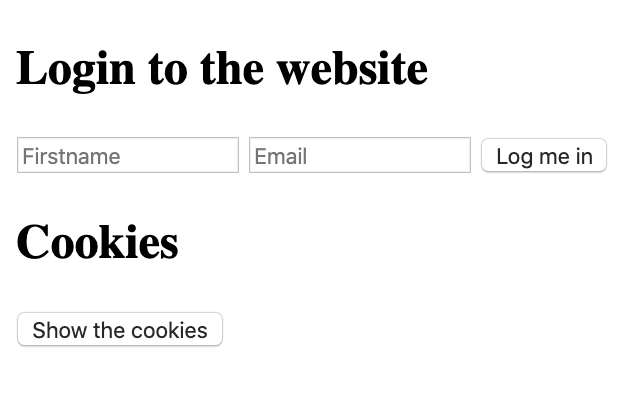
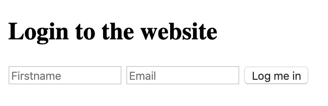
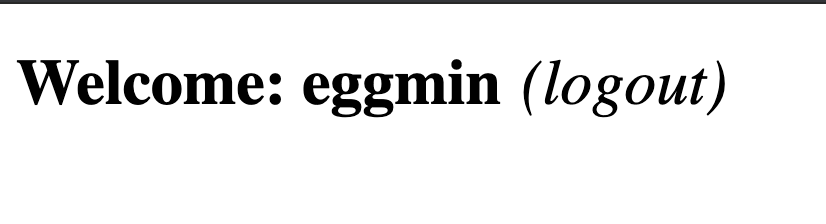
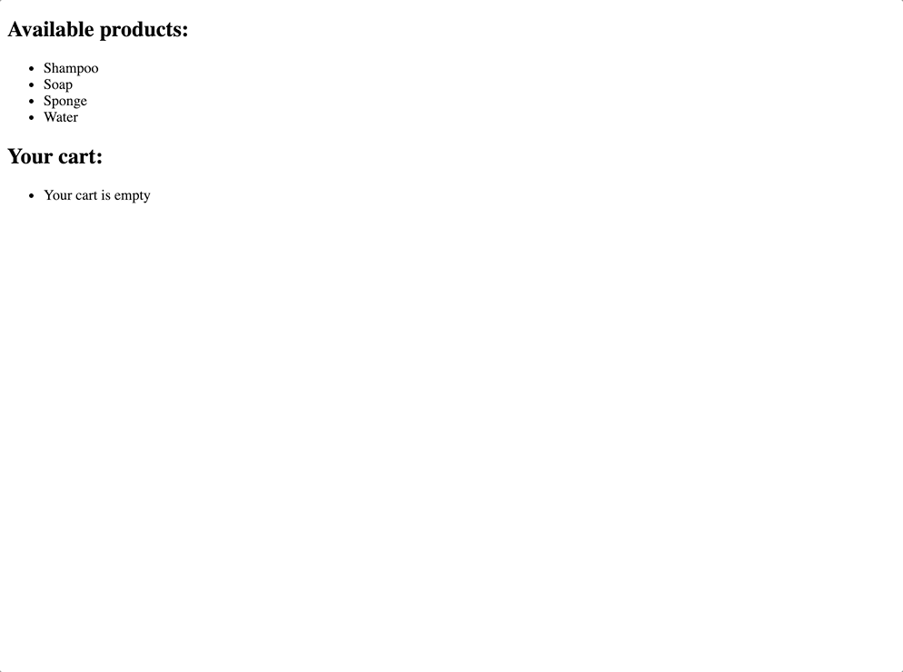

# Cookies & local storage

<h2>Resources</h2>

<strong>Read or watch:</strong>

<ul>
<li><a href="https://www.w3schools.com/js/js_cookies.asp" title="Cookies and Javascript" target="_blank">Cookies and Javascript</a></li>
<li><a href="https://developer.mozilla.org/en-US/docs/Web/HTTP/Cookies" title="HTTP Cookies" target="_blank">HTTP Cookies</a></li>
<li><a href="https://github.com/js-cookie/js-cookie" title="js-cookie" target="_blank">js-cookie</a></li>
<li><a href="https://www.w3schools.com/html/html5_webstorage.asp" title="Web storage" target="_blank">Web storage</a></li>
</ul>

<h2>Learning Objectives</h2>

<ul>
<li>Understand how to create cookies using Javascript</li>
<li>Learn how to set specific settings for the cookie</li>
<li>Learn how to read cookies with Javascript</li>
<li>How to use js-cookie for easy cookie manipulation</li>
<li>How to use the browser web storage</li>
<li>The differences between local storage and session storage</li>
</ul>

<h2>Requirements</h2>

<ul>
<li>Allowed editors: <code>vi</code>, <code>vim</code>, <code>emacs</code>, <code>Visual Studio Code</code></li>
<li>All your files should end with a new line</li>
<li>A <code>README.md</code> file, at the root of the folder of the project, is mandatory</li>
<li>Your code should use the <code>js</code> extension</li>
<li>All of your code will be compiled/executed on Ubuntu 18.04 using Node 12.x and npm 6.x</li>
<li><code>src/index.js</code> should stay empty - all your Javascript must be in your HTML, inside <code>&lt;script&gt;</code> tag</li>
</ul>

  

    <h3 class="panel-title">
      0. Create basic cookie
    </h3>
  

  

    

<ul>
<li>Install<code>webpack-dev-server</code> by running <code>npm install webpack-dev-server --save-dev</code> (if you have some errors of missing dependencies, install these packages: <code>npm i -D webpack</code> and <code>npm i -D webpack-cli</code>)</li>
<li>Create an empty file <code>src/index.js</code></li>
<li>Run your server with <code>node_modules/.bin/webpack-dev-server</code></li>
</ul>

<strong>In a file <code>0-index.html</code>, create a basic html template:</strong>

<ul>
<li>Add two text inputs, with the id <code>firstname</code> and <code>email</code></li>
<li>Add one button with the text &ldquo;Log me in&rdquo; that will call the function <code>setCookies</code></li>
<li>Add one button with the text &ldquo;Show the cookies&rdquo; that will call the function <code>showCookies</code></li>
<li>
Create a function <code>setCookies</code>:

<ul>
<li>It should set the cookie <code>firstname</code> with the value in the <code>firstname</code> input</li>
<li>It should set the cookie <code>email</code> with the value in the <code>email</code> input</li>
</ul></li>
<li>
Create a function <code>showCookies</code>:

<ul>
<li>It should create a DOM element <code>p</code></li>
<li>It should set the inner html with <code>Cookies:</code> and the value of the cookie</li>
<li>It should append the paragraph at the bottom of the page</li>
</ul></li>
</ul>

<strong>Requirements:</strong>

<ul>
<li>Try to make your page to look as close to the image below as possible</li>
</ul>

<ul>
<li>Access your code with <code>http://localhost:8080/0-index.html</code></li>
<li>Use vanilla javascript to complete the task</li>
</ul>

<strong>Tips:</strong>

<ul>
<li>If you are using <a href="https://code.visualstudio.com/" title="VSCode" target="_blank">VSCode</a>, you can use the plugin <a href="https://marketplace.visualstudio.com/items?itemName=ritwickdey.LiveServer" title="live server" target="_blank">live server</a> </li>
</ul>

  

    <h3 class="panel-title">
      1. Create cookie with expiration date and specific path
    </h3>

<ul>
<li>Reuse the code of the previous task</li>
<li>Modify the way you are setting cookies to expire in 10 days</li>
</ul>

<strong>Requirements:</strong>

<ul>
<li>Access your code with <code>http://localhost:8080/1-index.html</code></li>
<li>Use vanilla javascript to complete the task</li>
</ul>

  

 

    <h3 class="panel-title">
      2. Read cookie
    </h3>

<ul>
<li>
Reuse the code of the previous task
</li>
<li>
Create a function <code>getCookie</code>:

<ul>
<li>It accepts <code>name</code> as argument</li>
<li>It should return the value of the cookie with the <code>name</code> passed in argument</li>
<li>If the cookie does not exist, it should return an empty string</li>
</ul></li>
<li>
Modify the function <code>showCookies</code>:

<ul>
<li>It should display the paragraph <code>Email: EMAIL - Firstname: FIRSTNAME</code></li>
</ul></li>
</ul>

<strong>Requirements:</strong>

<ul>
<li>Access your code with <code>http://localhost:8080/2-index.html</code></li>
<li>Use vanilla javascript to complete the task</li>
</ul>
  

    <h3 class="panel-title">
      3. Delete cookie and mini application
    </h3>
  

  <!-- Task Body -->
   
<strong>in a file <code>3-index.html</code>, reuse your code from the previous task</strong>

<ul>
<li>
add a <code>div</code> in html that will contain the login form:

<ul>
<li>You can reuse the one you previously wrote</li>
<li>It has one <code>h2</code></li>
<li>It has two text inputs</li>
<li>It has one button</li>
</ul></li>
<li>
Write a function named <code>showForm</code>:

<ul>
<li>It should remove the Welcome message if it exists</li>
<li>It should show the form</li>
</ul></li>
<li>
Write a function named <code>hideForm</code>:

<ul>
<li>It should hide the form</li>
</ul></li>
<li>
Write a function named <code>deleteCookiesAndShowForm</code>:

<ul>
<li>It should remove the two cookies</li>
<li>it should show the form by calling the <code>showForm</code> function</li>
</ul></li>
<li>
Write a function named <code>showWelcomeMessageOrForm</code>:

<ul>
<li>if user is not logged in, the function <code>showForm</code> is called</li>
<li>If the user is logged in, replace the body of the page with a <code>h1</code>

<ul>
<li>It should display <code>Welcome FIRSTNAME (logout)</code></li>
<li><code>(logout)</code> should be a link

<ul>
<li>The link font should be display in normal weight, italic, and 10px to the right of the message</li>
<li>On click, call the function <code>deleteCookiesAndShowForm</code>, hide the welcome message, and show the form</li>
</ul></li>
</ul></li>
</ul></li>
</ul>

<strong>Requirements:</strong>

<ul>
<li>Access your code with <code>http://localhost:8080/3-index.html</code></li>
<li>Use vanilla javascript to complete the task</li>
<li>Build the Welcome message with Javascript without using HTML</li>
</ul>

<strong>The login form should look like the image below</strong>

<strong>When a user is logged in the page should look like the image below</strong>

  

 

    <h3 class="panel-title">
      4. Use js-cookie
    </h3>
  

  

    

  <!-- Task Body -->
   
<strong>Reusing the code from the previous task:</strong>

<ul>
<li>Add <code>js-cookie</code> to your html page using the <code>jsdelivr</code> CDN</li>
<li>Delete the <code>getCookie</code> function and use <code>js-cookie</code> get function instead</li>
<li>Use <code>js-cookie</code> remove function within <code>deleteCookiesAndShowForm</code> function</li>
<li>Use <code>js-cookie</code> set function within <code>setCookiesAndShowWelcomeMessage</code> function (new function that sets cookies and calls <code>showWelcomeMessageOrForm</code>)</li>
</ul>

<strong>Requirements:</strong>

<ul>
<li>Access your code with <code>http://localhost:8080/4-index.html</code></li>
<li>Build the Welcome message with Javascript without using HTML</li>
<li>Use <code>js-cookie</code> for every cookie manipulation</li>
</ul>

  

    <h3 class="panel-title">
      5. Local storage
    </h3>
  

  

    

<ul>
<li>Create an array <code>availableItems</code> that will contain all the available items. Add the strings <code>Shampoo</code>, <code>Soap</code>, <code>Sponge</code>, and <code>Water</code> in the array</li>
<li>If Local storage is not enabled on your browser, display an alert that will contain the message <code>Sorry, your browser does not support Web storage. Try again with a better one</code></li>
<li>If local storage is available it should allow the user to see the application and call the function <code>createStore</code> and <code>displayCart</code></li>
</ul>

<strong>Create a function <code>addItemToCart</code>:</strong>

<ul>
<li>It takes on argument <code>item</code> (string)</li>
<li>It adds a key to the local storage of the name of the item, and set the value to <code>true</code></li>
</ul>

<strong>Create a function <code>createStore</code>:</strong>

<ul>
<li>Create a <code>ul</code> and append it to the DOM</li>
<li>Loop through the array of items, and create a list item to add to the <code>ul</code></li>
<li>The item should display the name of the available product</li>
<li>On click the item should call the function <code>addItemToCart</code></li>
</ul>

<strong>Create a function <code>displayCart</code>:</strong>

<ul>
<li>If the local storage does not contain any item, this function does not do anything</li>
<li>If the local storage contains any item, it should display the message <code>You previously had X items in your cart</code> in a <code>p</code> element that you can append to the body</li>
</ul>

<strong>Tips:</strong>

<ul>
<li>At this time, you should be able to see the list of available items</li>
<li>If you click on two of them and refresh the browser, you should see the message <code>You previously had 2 items in your cart</code></li>
<li>If you open a new tab, you should also see the message <code>You previously had 2 items in your cart</code></li>
</ul>

<strong>Requirements:</strong>

<ul>
<li>Build the DOM using Javascript only</li>
<li>You must use the local storage of your browser and not a cookie or session storage</li>
<li>Access your code with <code>http://localhost:8080/5-index.html</code></li>
<li>Build every feature with vanilla Javascript only</li>
</ul>

  

    <h3 class="panel-title">
      6. Session storage
    </h3>
  

  <!-- Task Body -->
  
Reusing the code from the previous task, replace the use of local storage by session storage

<strong>Tips:</strong>

<ul>
<li>At this time, you should be able to see the list of available items</li>
<li>If you click on two of them and refresh the browser, you should see the message <code>You previously had 2 items in your cart</code></li>
<li>If you open a new tab, you should not see any message</li>
</ul>

<strong>Requirements:</strong>

<ul>
<li>Build the DOM using Javascript only</li>
<li>You must use the session storage of your browser and not a cookie or local storage</li>
<li>Access your code with <code>http://localhost:8080/6-index.html</code></li>
<li>Build every feature with vanilla Javascript only</li>
</ul>
  

    <h3 class="panel-title">
      7. Advanced use of web storage
    </h3>

  <!-- Task Body -->
  
<strong>In a new file, let&rsquo;s build a more advanced cart system using Session Storage. Setup your files with the following:</strong>

<ul>
<li>Create an array <code>availableItems</code> that will contain all the available items. Add the strings <code>Shampoo</code>, <code>Soap</code>, <code>Sponge</code>, and <code>Water</code> to the array</li>
<li>If session storage is not enabled on your browser, display an alert that will contain the message <code>Sorry, your browser does not support Web storage. Try again with a better one</code></li>
<li>If session storage is available it should allow the user to see the application and call the function <code>createStore</code> and <code>displayCart</code></li>
</ul>

<strong>Create a function <code>getCartFromStorage</code>:</strong>

<ul>
<li>It should parse a string into a JSON object, returning the content of the cart stored in Session storage</li>
<li>If there is no cart, it should return an empty object</li>
</ul>

<strong>Create a function <code>addItemToCart</code>:</strong>

<ul>
<li>It accepts <code>item</code>(string) as argument</li>
<li>It adds to the cart object the item</li>
<li>If the same item is added multiple times, the cart store the quantity</li>
<li>It stores the value of the cart object in a string for the key <code>cart</code> in the Session Storage</li>
<li>It calls <code>displayCart</code></li>
</ul>

<strong>Create a function <code>removeItemfromCart</code>:</strong>

<ul>
<li>It accepts <code>item</code>(string) as argument</li>
<li>It remove the entire item from the cart</li>
<li>Store the value of the cart object in a string for the key <code>cart</code> in the Session Storage</li>
<li>It calls <code>displayCart</code></li>
</ul>

<strong>Create a function <code>clearCart</code>:</strong>

<ul>
<li>It should clear the entire Session storage</li>
<li>it calls <code>displayCart</code></li>
</ul>

<strong>Create a function <code>createStore</code>:</strong>

<ul>
<li>It should add a <code>h2</code> tag with the text <code>Available products:</code></li>
<li>It should add a list with every item available for purchase</li>
<li>When the user click on an item, it should add it to the cart</li>
</ul>

<strong>Create a function <code>displayCart</code>:</strong>

<ul>
<li>It should add inside a <code>h2</code> tag with the text <code>Your cart:</code></li>
<li>It should add an empty <code>div</code> tag</li>
<li>If the <code>div</code> tag already exist, it should remove any list child</li>
<li>It calls updateCart</li>
</ul>

<strong>Create a function <code>updateCart</code>:</strong>

<ul>
<li>It should add a list to the <code>div</code> tag created previously</li>
<li>If the cart is empty, it should add an item <code>Your cart is empty</code></li>
<li>If the cart is not empty, it should add the list of items within the cart with the following format: <code>ITEM_NAME x QUANTITY (remove)</code></li>
<li>When the user clicks on remove, it should call the function <code>removeItemfromCart</code></li>
<li>At the top of the cart, add an item named <code>Clear my cart</code>. When the user clicks on it, it should call the function <code>clearCart</code></li>
</ul>

<strong>Tips:</strong>

<ul>
<li>You can look at the GIF below to see how the interaction with the different elements works</li>
</ul>

<strong>Requirements:</strong>

<ul>
<li>Build the DOM using Javascript only</li>
<li>You must use the session storage of your browser and not a cookie or local storage</li>
<li>Access your code with <code>http://localhost:8080/7-index.html</code></li>
<li>Build every feature with vanilla Javascript only</li>
<li><code>src/index.js</code> should stay empty - all your Javascript must be in your HTML, inside <code>&lt;script&gt;</code> tag</li>
</ul>

  

